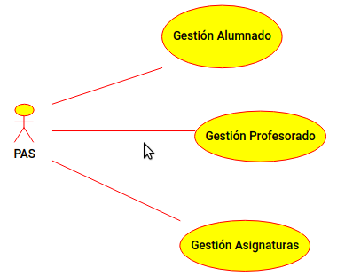

# Gestión Académica JDBC

El presente proyecto forma parte de una de las tareas de 
la asignatura de Acceso a Datos del Ciclo Formativo de Grado Superior de 
Desarrollo de Aplicaciones Multiplataforma. 

## Introducción a la tarea

Básicamente se trata de crear un CRUD para alumnos, otro CRUD para 
profesores, otro CRUD para asignaturas, un maestro-detalle para ver 
asignaciones de profesores a asignaturas y otro para matriculación de 
alumnos en asignaturas.

Para implementarlo, deberemos tener un servicio REST programado como un servlet 
Java en un contenedor Tomcat (cuidado, Tomcat no es un contenedor de EJB luego no 
soportará correctamente la inyección del EntityManagerFactory en las clases de los 
servicios), TomEE o GlashFish, contra una base de datos relacional Oracle o MySQL.

En cuanto al cliente, deberá ser en HTML5+JS (concretamente jQuery) y comunicarse con 
el servicio anterior en XML o en JSON.

El código de ejemplo para crear el servicio así como la base de datos lo 
puedes encontrar [en este otro repositorio](https://github.com/juangualberto/GA-JPA).

*** RECOMENDAMOS MONTAR EL SERVICIO SOBRE GLASHFISH 4.1 ***. Glashfish 4.1.1 tiene un 
bug que da problemas a la hora de producir / consumir JSON. Tomcat no es un contenedor EJB, 
luego no van a funcionar todas las inyeccciones y tedremos que tocar el código generado por Netbeans.


## Documentación

Nos basta con una escueta documentación, aunque sí vamos a necesitar varios diagramas que detallamos a continuación. 
Veamos unos ejemplos con el proyecto que hemos estado usando en clase (Gestión Académica).

### Casos de uso

Un caso de uso no es más que plasmar ejemplos de cómo los actores (usuarios 
de nuestro sistema) interactúan con nuestra aplicación. Esto nos ayudará 
a dividir el problema en cada una de sus partes.



### Diagrama entidad/relación

El diagrama entidad/relación es el paso previo al diseño de tablas de la 
base de datos y nunca debe faltar en la fase de diseño.


### Diagrama de clases

Otro diagrama fundamental en UML es el diagrama de clases. En el vemos los objetos que habrá en nuestra aplicación y cómo 
interactuarán entre ellos. 


### Manual de instalación y configuración

#### Fichero README.md / README.txt

Es fundamental tener un fichero en el raíz del proyecto donde se explique cómo instalar y configurar el servicio.

#### Automatización de tareas

La automatización de tareas es muy recomendable. Según el grado de dificultad:

1. La opción sencilla sencilla es simplemente descomprimir el proyecto o bien mediante 
clonación desde GitHub, GitBucket... y/o añadir scripts (bash, poweshell...) o bien 
detallar las instrucciones **en una receta en el README** del repositorio.
2. La opción más completa es usar un sistema automático, tipo gestión de proyectos
como [] o bien automatización de tareas como 
[]. En clase ya hemos hecho una pequeña introducción a 
gestión de proyectos desde el pom.xml con Maven.

### Breve manual de usuario

Basta con explicar las funcionalidades del sistema.

## BACK-END: Generando servicios REST con el IDE

#### Creación de la base de datos, usuarios y las tablas

En clase vamos a hacer el servicio Web productor/consumidor de JSON 
manualmente, aunque es posible hacerlo de manera automática usando las 
capacidades del IDE.

Aquí tienes más información por si quieres ampliar para el tema 
próximo:
Creación de la base de datos y carga inicial: ***Videotutorial en Youtube*** 
[](http://www.youtube.com/watch?v=pPQ5Ul2-RFs)

Código fuente: [CargaInicial.sql](https://github.com/juangualberto/GA-JPA/blob/master/src/java/CargaInicial.sql)

#### Creación del servicio REST con Netbeans

***Videotutorial en Youtube***: 

[](http://www.youtube.com/watch?v=kZQ60EW6gLg)

## FRONT-END Creación del cliente

Haciendo uso de jQuery y Materialize o BootStrap, tenemos que desarrollar una Web APP
que consuma y produzca recursos de y para nuestro servicio Web. Es decir, vamos a 
realizar el front-end con HTML5+JS(+CSS) según la filosofía SAP (Single Application Page).

### MaterializeCSS

Para que cargue correctamente todos los estilos, funcionen los menús y animaciones de
Materialize CSS, debes tener en el head de tu página algo parecido a esto:

```html
<head>
        <script src="js/jquery-3.2.1.min.js" type="text/javascript"></script>
        <link href="css/materialize.min.css" rel="stylesheet" type="text/css"/>
        <link rel = "stylesheet" href = "https://fonts.googleapis.com/icon?family=Material+Icons">
        <script src="js/materialize.min.js" type="text/javascript"></script>
        <link href="css/styles.css" rel="stylesheet" type="text/css"/>
        <script src="js/index.js" type="text/javascript"></script>
        <title>Gestión Académica</title>
        <meta charset="UTF-8">
        <meta name="viewport" content="width=device-width, initial-scale=1.0">
</head>
    
```


### Front-end: Controlador con jQuery 


## Solución al problema del CORS

Si queremos usar XML y AJAX, tenemos que habilitar el CORS en nuestros servicios con Tomcat. La manera más usual es creando un filtro:
```java
package com.iesvdc.acceso.filtro;
import java.io.IOException;
import javax.servlet.Filter;
import javax.servlet.FilterChain;
import javax.servlet.FilterConfig;
import javax.servlet.ServletException;
import javax.servlet.ServletRequest;
import javax.servlet.ServletResponse;
import javax.servlet.http.HttpServletResponse;

public class SimpleCORSFilter implements Filter {

 public void doFilter(ServletRequest req, ServletResponse res, FilterChain chain) throws IOException, ServletException {
  HttpServletResponse response = (HttpServletResponse) res;
  response.setHeader("Access-Control-Allow-Origin", "*");
  response.setHeader("Access-Control-Allow-Methods", "POST, GET, PUT, OPTIONS, DELETE");
  response.setHeader("Access-Control-Max-Age", "3600");
  response.setHeader("Access-Control-Allow-Headers", "Origin, x-requested-with, Content-Type, Accept");
  chain.doFilter(req, res);
 }

 public void init(FilterConfig filterConfig) {}

 public void destroy() {}
 
}
```

## Puntuación rápida

Básicamente, por la documentación y el servicio REST se obtendrá el 50% de la nota. 
Si no se hace cliente, se deberán crear varios scripts o comandos CURL de test para probarlo.

Del 50% restante, 20% es conseguir en el cliente una interfaz maestro/detalle y 30% 
por el resto de CRUD desde el cliente.

El cliente debe estar implementado usando jQuery y la comunicación entre cliente/servidor con XML/JSON.

Si el cliente no usa JavaScript pero está en HTML, la nota máxima posible sería 60% (sobre el 100%).

Si se implementa un lector de código de barras con XDK para un CRUD, estás exento del maestro/detalle.


